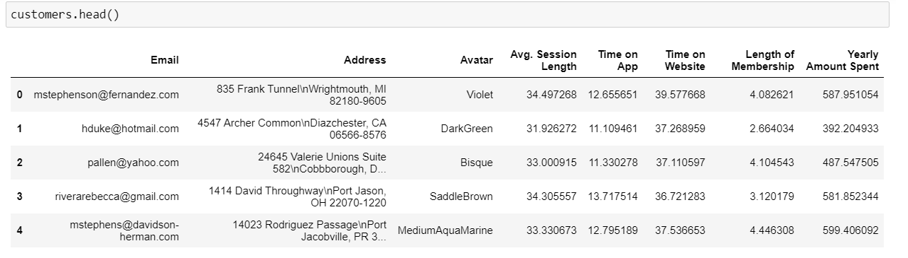
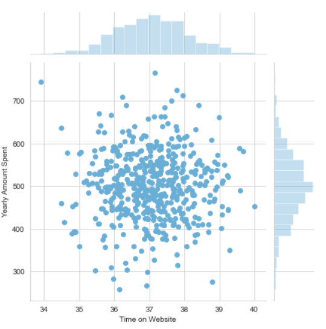
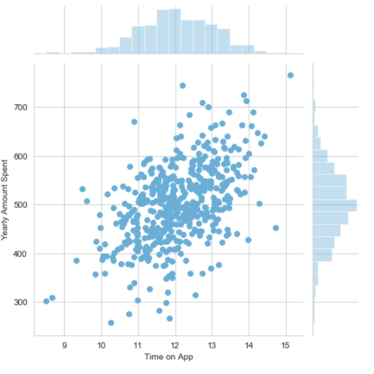

# Linear-Regression
This project is done to solve the dilemma of a company who are deciding wether they should put more effort on developing the website or they should put more effort on developing their application.

The data files are given . The data files give us the information about various aspects of the user . These aspects or features can be used to get a relationnship
between the user and the company . This will help us to identify what the user exactly wants .

The relationship between time on website and amount spent yearly is done .This gives us a better a picture about their relationship.

The relationship between time spent on application and the amount spent yearly is done . This gives us a clearer picture of what the user want

